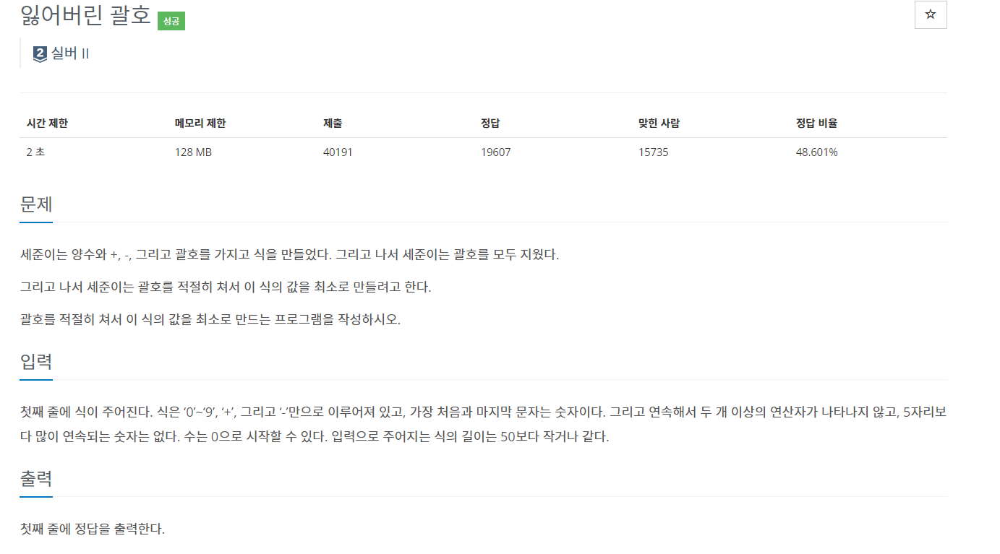
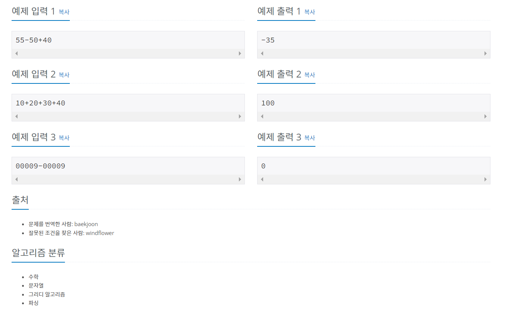

#백준 1541번-잃어버린 괄호, 실버2




```
exp = input()
num = []

a = []
b= []
a.append(exp[0])
i = 1 

#숫자는 a에 한자리씩 가져와서 num에, 연산은 b에 저장
while i < len(exp):
    if exp[i] == '+' or exp[i] == '-':
        num.append(a)
        a=[]
        b.append(exp[i])
        i += 1
    else :
        a.append(exp[i])
        i += 1
num.append(a)

r_num = []
for i in range(len(num)):
    r_num.append(int(''.join(num[i])))

sum = r_num[0]

i = 0
while i < len(b):
    # +연산일 때 
    if b[i] == '+':
        sum += r_num[i+1]

    # -연산일 때
    elif b[i] == '-':
        #식의 마지막 - 연산일 때
        if i+1 >= len(b):
            sum -= r_num[i+1]
            
        # - 연산 다음 - 연산일 때
        elif b[i+1] == '-':
            sum -= r_num[i+1]

        # - 연산 다음 + 연산의 경우 괄호
        elif b[i+1] =='+':
            sum1 = 0
            i += 1
            while i < len(b) and b[i] == '+' :
                sum1 += r_num[i]
                i += 1
            sum1 += r_num[i]
            sum -= sum1
            continue

    i += 1

print(sum)
```

- 연산 다음 + 연산의 경우에만 괄호가 있는 효과를 주면 최솟값을 구할 수 있다.
예를 들면 55 - 50 + 40 에서 55 에서 50을 빼준 후 40을 더하면 10을 빼는 효과인데, (50 + 40) 계산 후 55에서 빼면 90을 빼는 효과로 더 큰 수를 뺀다.
