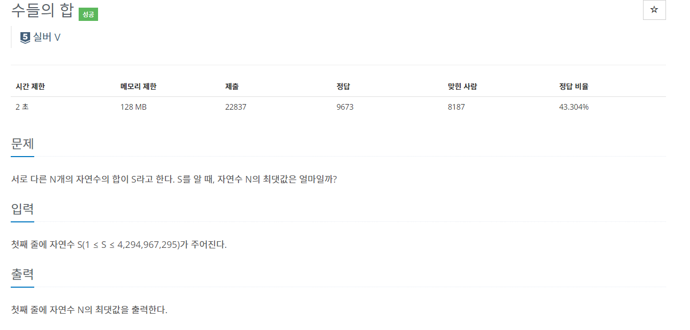
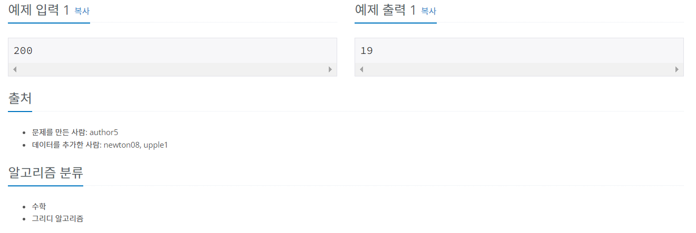

# 백준 1789번 - 수들의 합, 실버5




```
s = int(input())
cnt = 0
sum = 0

for i in range(1,s):
    if sum == s:
        break
    
    #자연수들의 합이 원하는 합보다 클 때 개수를 하나 줄이고 반복문 종료
    elif sum > s :
        cnt-=1
        break
    sum += i
    cnt += 1

print(cnt)

```
