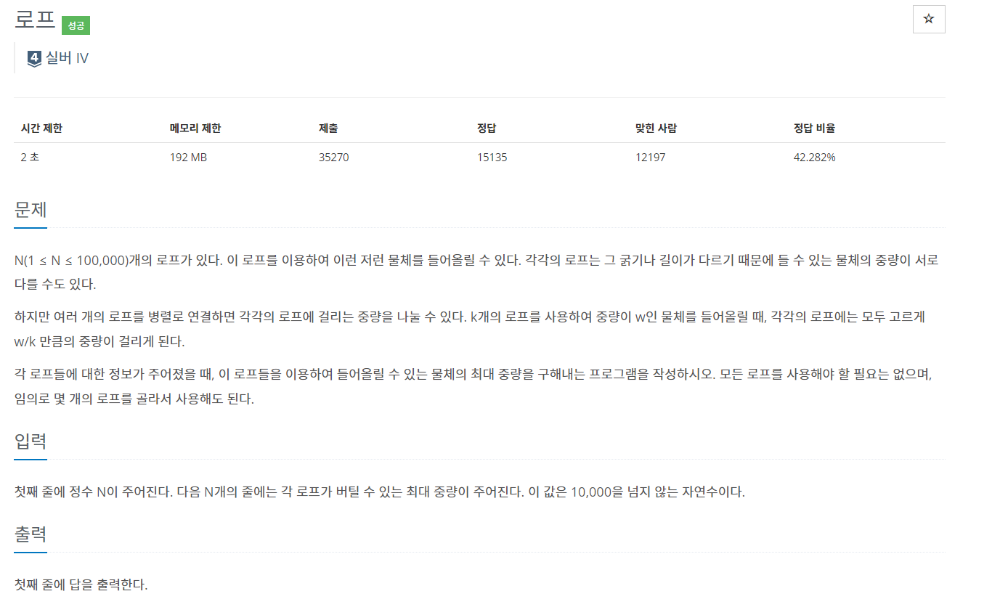
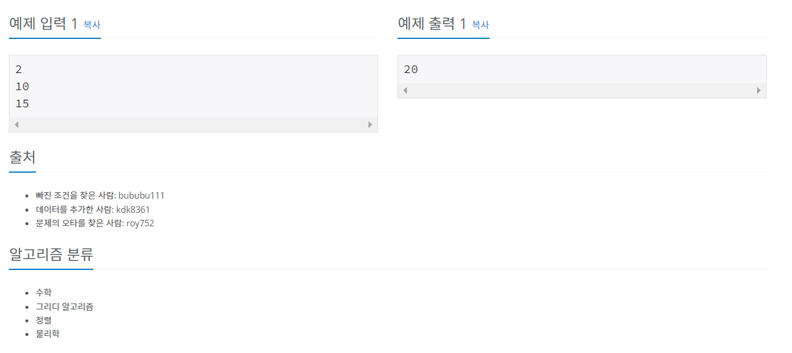

# 백준 2217번 - 로프, 실버4




```
n = int(input())
rope=[]
for i in range(n):
    rope.append(int(input()))

rope.sort(reverse = True)

##가장 큰 수를 초기값으로 설정
ans = rope[0]

##현재까지 가장 큰 값과 그 다음으로 큰 값을 들 수 있는 로프만큼 더한 값과 비교
for i in range(1,len(rope)):
    if ans < rope[i]*(i+1):
        ans = rope[i] * (i+1)

print(ans)

```
