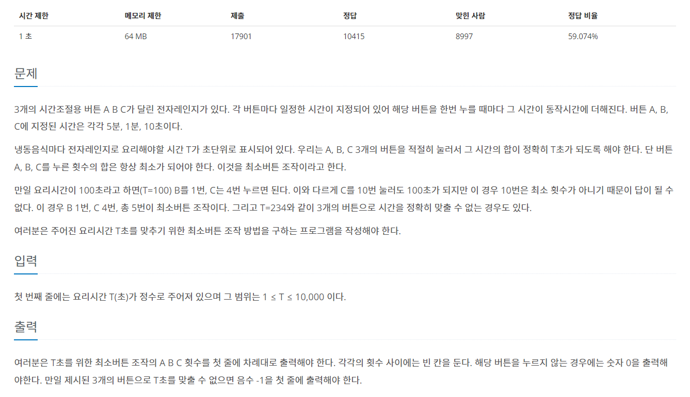
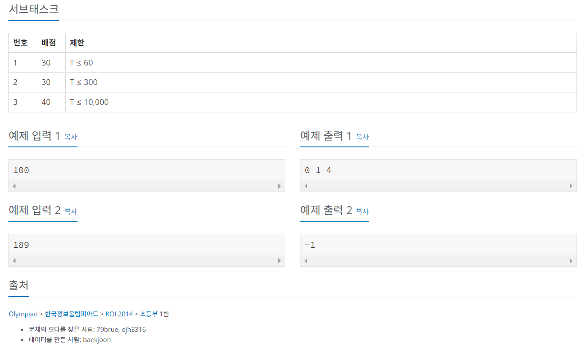

# 백준 10162번 - 전자레인지, 브론즈4



알고리즘분류
* 수학
* 구현
* 그리디 알고리즘

```
t = int(input())

a = 5 * 60   #5분
b = 60       #1분
c = 10       #10초 

#가장 큰 단위인 a 부터 개수를 셈
cnt_a = t // a
t -= a * cnt_a

cnt_b = t // b
t -= b * cnt_b

cnt_c = t // c
t -= c * cnt_c

#남은 초가 0이 아니라면 a,b,c에 의해 맞출 수 없음을 의미
if t != 0:
    print("-1")

else :
    print(cnt_a, cnt_b, cnt_c)
```
