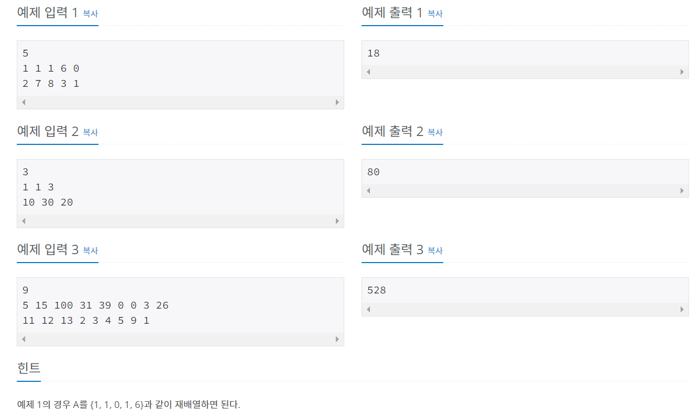

# 백준 1026번 문제 - 보물, 실버4



```
n = int(input())
a = list(map(int, input().split()))
b = list(map(int, input().split()))

a.sort()
sum = 0

#a에서 가장 작은 값과 b에서 가장 큰 값을 곱함
for i in range(n):
    sum += a[i] * max(b)
    b.remove(max(b))

print(sum)

```
