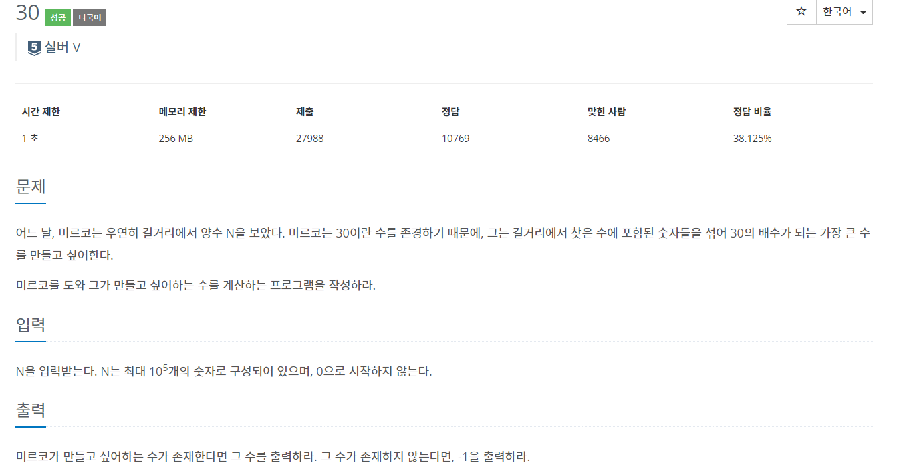
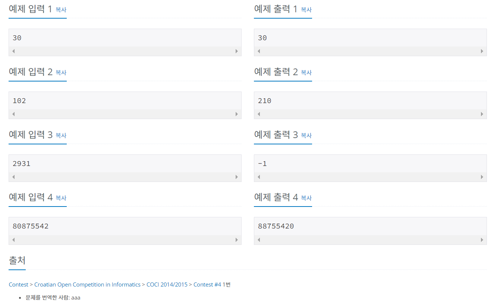

# 백준 10610번 - 30, 실버5





알고리즘 분류
* 수학
* 문자열
* 그리디 알고리즘
* 정렬
* 정수론

```
n = input()

#0이 없으면 10의 배수가 아님 -> 30의 배수도 아님
if n.find('0')< 0:
    print("-1")

else:
    a = list(n)
    #3의 배수는 각 자릿수의 합이 3의 배수여야함
    sum = 0
    for i in range(len(a)):
        sum += int(a[i])
    if sum % 3 != 0 :
        print("-1")

    #30의 배수 중 가장 큰 수 찾기 위해 큰 수부터 정렬, 0은 제일 작으므로 맨 뒤로 감 
    else:
        for i in range(len(a)):
            a[i] = int(a[i])
        a.sort(reverse=True)

        for i in range(len(a)):
            print(a[i], end='')
```
