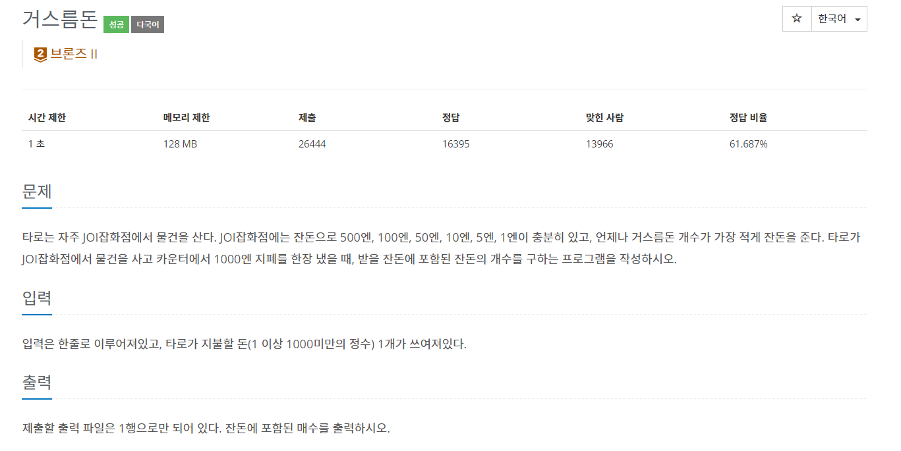
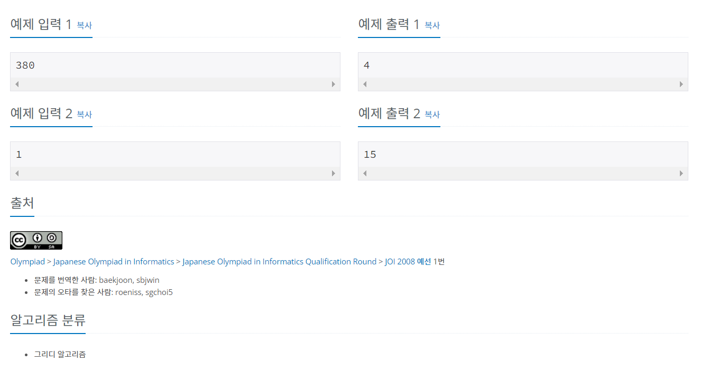

# 백준 5585번 - 거스름돈, 브론즈 2



```
n = int(input())

#거스름돈
rest = 1000 - n

##500엔 개수
five_h = rest // 500
rest -= 500 * five_h

##100엔 개수
one_h = rest // 100
rest -= 100 * one_h

##50엔 개수
fifty = rest // 50
rest -= 50 * fifty

##10엔 개수
ten = rest // 10
rest -= 10 * ten

##5엔 개수
five = rest // 5
rest -= 5 * five

##1엔 개수
one = rest

print(five_h+one_h+fifty+ten+five+one)
```
